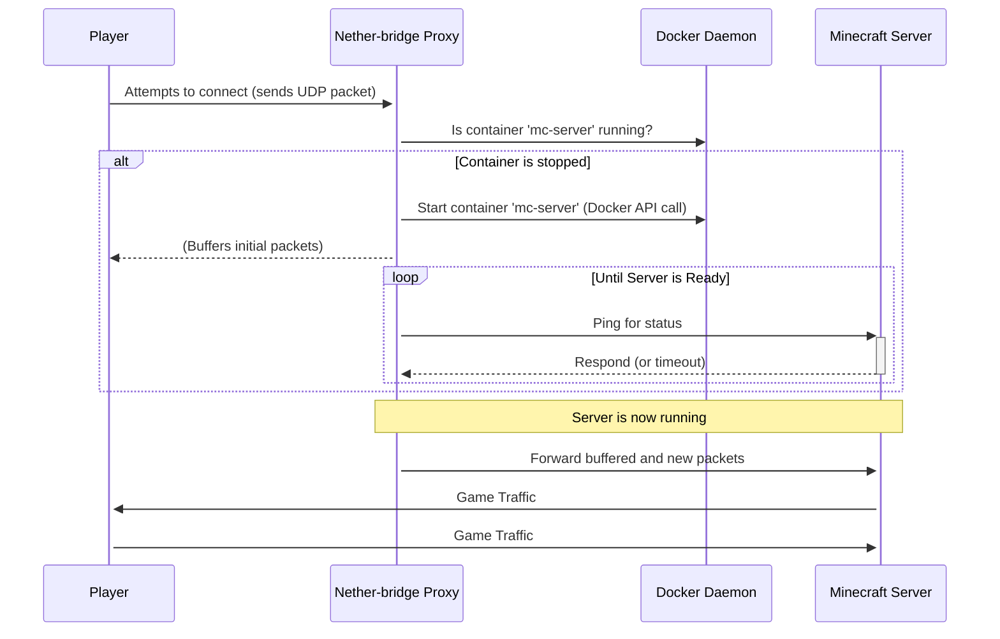

# Nether-bridge: On-Demand Minecraft Server Proxy

[](https://github.com/meek2100/nether-bridge/actions/workflows/main-build.yml)
[](https://github.com/meek2100/nether-bridge/releases)

Nether-bridge is an intelligent proxy for Minecraft servers running in Docker. It automatically starts server containers when a player tries to connect and stops them after a period of inactivity, helping to save system resources.

This is ideal for home server environments where multiple Minecraft servers (Java or Bedrock) are available but not always in use.

## Features

- **On-Demand Server Startup**: Automatically starts Minecraft server containers when a player connection is detected.
- **Multi-Platform Support**: Natively supports both **Minecraft: Java Edition** and **Minecraft: Bedrock Edition** servers.
- **Automatic Shutdown**: Monitors server activity and stops containers after a configurable idle period to free up resources.
- **Multi-Server Support**: Manages multiple Minecraft servers simultaneously, each on its own port.
- **Dynamic Readiness Probing**: Uses `mcstatus` to actively query the server status, ensuring it's fully ready before forwarding player traffic.
- **Flexible Configuration**: Configure entirely with environment variables or use JSON files for local overrides.
- **Robust Health Checks**: A two-stage health check correctly reports the container's status for Docker and orchestrators.
- **Docker-Native**: Designed to integrate seamlessly with a Docker-based server setup using the host's Docker socket.

## How It Works

The proxy listens for initial player connection packets on the ports you define. Its orchestration logic is simple and resource-efficient.

1. A player attempts to connect to a server address that points to the Nether-bridge proxy.
2. The proxy receives the first packet and checks if the corresponding Minecraft server container is running.
3. **If the server is stopped**, the proxy issues a `docker start` command (via the Docker API) and temporarily buffers the player's connection packets.
4. The proxy then begins probing the server until it responds to a status query, indicating it's fully loaded.
5. Once the server is ready, the proxy forwards the buffered packets and establishes a direct, two-way UDP stream between the player and the server.
6. A background thread continuously monitors the player count on all active servers. If a server has zero players for a configurable amount of time, the proxy issues a `docker stop` command (via the Docker API) to shut it down safely.



## Installation

### Prerequisites

- Docker and Docker Compose installed on your server.
- Port `19132/udp` (or other desired proxy listen ports) open on your firewall if players connect from outside your local network.

### Setup Steps

1. **Clone the repository:**

    ```bash
    git clone https://github.com/meek2100/nether-bridge.git
    cd nether-bridge
    ```

2. **Configure your servers:**
    - **Recommended (Environment Variables):** Edit the `docker-compose.yml` file and set the `NB_X_...` environment variables for each Minecraft server you want to manage. This method is preferred for Docker deployments.
    - **Alternative (JSON Files):** Create `settings.json` and `servers.json` files in the root directory (see **Configuration** section below for examples). Ensure these files are mounted into the `nether-bridge` container in `docker-compose.yml` if you use this method.
3. **Start the proxy and Minecraft servers:**

    ```bash
    docker compose up -d
    ```

    This will start the `nether-bridge` proxy and your defined Minecraft server containers (though the Minecraft servers will initially be stopped by the proxy until a player connects).

    > **Important Security Note**
    >
    > The `nether-bridge` container requires access to `/var/run/docker.sock` to manage other Docker containers. Mounting the Docker socket grants the container privileges equivalent to **root-level access** on the host system.
    >
    > Ensure your Docker host is properly secured and only run trusted applications with this level of access.

## Configuration

Nether-bridge can be configured using environment variables or JSON files. Environment variables take precedence over settings found in `settings.json` and `servers.json`.

1. **Environment Variables**: Ideal for most Docker and container-based setups.
2. **JSON Files**: A convenient alternative for local setups or when you prefer keeping configurations in separate files.

These methods can be mixed, but it's important to understand the order of precedence:

### Environment Variables > Mounted JSON Files > Built-in Defaults

Any setting defined as an environment variable will override the same setting found in a mounted `settings.json` or `servers.json` file. The application uses built-in defaults for any setting not provided by either method.

### Method 1: Environment Variables (Recommended)

This is the recommended approach for most users. You define all proxy settings and server definitions directly in your `docker-compose.yml` file.

**Example `docker-compose.yml` using only Environment Variables:**

```yaml
services:
  nether-bridge:
    image: ghcr.io/meek2100/nether-bridge:latest
    container_name: nether-bridge
    restart: unless-stopped
    ports:
      - "19132:19132/udp"
      - "25565:25565/udp"
      - "25565:25565/tcp"
    volumes:
      - /var/run/docker.sock:/var/run/docker.sock
    environment:
      # --- General Settings ---
      - LOG_LEVEL=INFO
      - NB_IDLE_TIMEOUT=600

      # --- Server Definitions ---
      # Server 1: Bedrock
      - NB_1_SERVER_TYPE=bedrock
      - NB_1_LISTEN_PORT=19132
      - NB_1_CONTAINER_NAME=mc-bedrock
      - NB_1_INTERNAL_PORT=19132
      # Server 2: Java
      - NB_2_SERVER_TYPE=java
      - NB_2_LISTEN_PORT=25565
      - NB_2_CONTAINER_NAME=mc-java
      - NB_2_INTERNAL_PORT=25565

  # ... your mc-bedrock and mc-java services
```

### Method 2: JSON Files

This method is useful if you prefer to keep your server list and settings in separate files.

**Step 1: Create your JSON files.**

- Create a `settings.json` file for general proxy settings.
- Create a `servers.json` file to define your Minecraft servers.

**Example `servers.json`:**

```json
{
  "servers": [
    {
      "name": "Bedrock Survival",
      "server_type": "bedrock",
      "listen_port": 19132,
      "container_name": "mc-bedrock",
      "internal_port": 19132
    }
  ]
}
```

**Step 2: Update `docker-compose.yml` to mount the files.**
Modify your `docker-compose.yml` to mount these files into the container. Note that the `environment` section for server definitions would typically be removed.

```yaml
services:
  nether-bridge:
    image: ghcr.io/meek2100/nether-bridge:latest
    container_name: nether-bridge
    restart: unless-stopped
    ports:
      - "19132:19132/udp"
      - "25565:25565/tcp"
    volumes:
      - /var/run/docker.sock:/var/run/docker.sock
      # Mount your configuration files from a local 'data' directory
      - ./data/nether-bridge/settings.json:/app/settings.json
      - ./data/nether-bridge/servers.json:/app/servers.json
    # Environment variables can still be used to override specific JSON values
    environment:
      - LOG_LEVEL=DEBUG # Overrides LOG_LEVEL from settings.json

  # ... your mc-bedrock and mc-java services
  ```

### Main Proxy Settings

These settings control the proxy's behavior, such as idle timeouts and query intervals.

| Environment Variable | `settings.json` Key | Default Value | Description |
| :------------------------------- | :----------------------------------- | :------------ | :--------------------------------------------------------------------------------------------------------------------------------------------------------------------------------------------------------------------------------------------- |
| `LOG_LEVEL` | `log_level` | `INFO` | Sets the logging verbosity. Options: `DEBUG`, `INFO`, `WARNING`, `ERROR`, `CRITICAL`. |
| `LOG_FORMAT` | `log_format` | `console` | Sets the logging format. console for human-readable, colored logs (ideal for development/debugging). json for structured, machine-readable logs (recommended for production/CI). |
| `NB_IDLE_TIMEOUT` | `idle_timeout_seconds` | `600` | Time in seconds a server must have 0 players before it's automatically stopped. |
| `NB_PLAYER_CHECK_INTERVAL` | `player_check_interval_seconds` | `60` | How often (in seconds) the proxy checks for active players on running servers. |
| `NB_QUERY_TIMEOUT` | `query_timeout_seconds` | `5` | Timeout (in seconds) for `mcstatus` queries when checking server readiness or player counts. |
| `NB_SERVER_READY_MAX_WAIT` | `server_ready_max_wait_time_seconds` | `120` | Maximum time (in seconds) the proxy will wait for a newly started server to respond to status queries before giving up and forwarding packets anyway. |
| `NB_INITIAL_BOOT_READY_MAX_WAIT` | `initial_boot_ready_max_wait_time_seconds` | `180` | Maximum time (in seconds) the proxy will wait for servers to become query-ready during initial startup (before issuing safe stops). This allows for longer initial boot times. |
| `NB_SERVER_STARTUP_DELAY` | `server_startup_delay_seconds` | `5` | Delay (in seconds) after issuing a Docker start command before the proxy begins probing the server for readiness. Gives the server a moment to begin initializing. |
| `NB_INITIAL_SERVER_QUERY_DELAY` | `initial_server_query_delay_seconds` | `10` | Delay (in seconds) before the proxy attempts to query a server that was found running on proxy startup. This allows time for the server to stabilize if it was previously mid-startup or in a crashed state. |
| `NB_HEALTHCHECK_STALE_THRESHOLD` | `healthcheck_stale_threshold_seconds` | `60`    | Time in seconds before the main process heartbeat is considered stale by the health check. |
| `NB_HEARTBEAT_INTERVAL`          | `proxy_heartbeat_interval_seconds`  | `15`    | How often (in seconds) the main proxy loop updates its heartbeat file.                |

**Example `settings.json`:**

```json
{
  "idle_timeout_seconds": 900,
  "player_check_interval_seconds": 30,
  "query_timeout_seconds": 3,
  "log_level": "DEBUG"
}
```

### Server Definitions

These settings define each Minecraft server managed by Nether-bridge. You can define multiple servers.

| Environment Variable Prefix (e.g., `NB_1_`) | `servers.json` Key | Type | Description | Required |
| :------------------------------------------ | :------------------- | :------ | :------------------------------------------------------------------------------------------ | :------- |
| `NB_X_NAME` | `name` | string | A friendly name for the server (e.g., "Bedrock Survival"). | No |
| `NB_X_SERVER_TYPE` | `server_type` | string | Type of Minecraft server: `bedrock` or `java`. | Yes |
| `NB_X_LISTEN_PORT` | `listen_port` | integer | The UDP port Nether-bridge listens on for this server (players connect to this port). | Yes |
| `NB_X_CONTAINER_NAME` | `container_name` | string | The Docker container name of the Minecraft server. | Yes |
| `NB_X_INTERNAL_PORT` | `internal_port` | integer | The internal port the Minecraft server listens on inside its container (usually `19132` for Bedrock, `25565` for Java). | Yes |

*Replace `X` with a unique, sequential number (e.g., `1`, `2`, `3`) for each server when using environment variables.*

**Example `docker-compose.yml` (using environment variables - recommended):**

```yaml
services:
  # ... other services like mc-bedrock, mc-java ...
  nether-bridge:
    container_name: nether-bridge
    image: ghcr.io/meek2100/nether-bridge:latest # Use a specific version in production, e.g., ghcr.io/meek2100/nether-bridge:1.0.0
    restart: unless-stopped
    networks:
      - mc-network
    ports:
      - "19132:19132/udp" # Port for Bedrock server (NB_1_LISTEN_PORT)
      - "25565:25565/udp" # Port for Java server discovery (NB_2_LISTEN_PORT)
      - "25565:25565/tcp" # Port for Java server gameplay (needs to be exposed by Docker)
    volumes:
      - /var/run/docker.sock:/var/run/docker.sock # Required for Docker management
      # Optionally mount JSON config files (uncomment to use these instead of environment variables)
      # - ./data/nether-bridge/settings.json:/app/settings.json
      # - ./data/nether-bridge/servers.json:/app/servers.json
    environment:
      # General settings
      - LOG_LEVEL=INFO
      - NB_IDLE_TIMEOUT=300
      - NB_PLAYER_CHECK_INTERVAL=60
      - NB_QUERY_TIMEOUT=5
      - NB_SERVER_READY_MAX_WAIT=120
      - NB_INITIAL_BOOT_READY_MAX_WAIT=180
      - NB_SERVER_STARTUP_DELAY=5
      - NB_INITIAL_SERVER_QUERY_DELAY=10

      # --- Server Definitions ---
      # Server 1: Bedrock Survival
      - NB_1_NAME=Bedrock Survival
      - NB_1_SERVER_TYPE=bedrock
      - NB_1_LISTEN_PORT=19132
      - NB_1_CONTAINER_NAME=mc-bedrock # Must match the Minecraft game server's container name
      - NB_1_INTERNAL_PORT=19132

      # Server 2: Java Creative
      - NB_2_NAME=Java Creative
      - NB_2_SERVER_TYPE=java
      - NB_2_LISTEN_PORT=25565
      - NB_2_CONTAINER_NAME=mc-java # Must match the Minecraft game server's container name
      - NB_2_INTERNAL_PORT=25565
```

**Example `servers.json` (alternative to environment variables):**

```json
{
  "servers": [
    {
      "name": "Bedrock Survival",
      "server_type": "bedrock",
      "listen_port": 19132,
      "container_name": "mc-bedrock", # Must match the Minecraft game server's container name
      "internal_port": 19132
    },
    {
      "name": "Java Creative",
      "server_type": "java",
      "listen_port": 25565,
      "container_name": "mc-java", # Must match the Minecraft game server's container name
      "internal_port": 25565
    }
  ]
}
```

If using `servers.json` or `settings.json`, you must uncomment and add the volume mounts in your `docker-compose.yml` for the `nether-bridge` service:

```yaml
    volumes:
      - /var/run/docker.sock:/var/run/docker.sock # Required
      - ./data/nether-bridge/settings.json:/app/settings.json
      - ./data/nether-bridge/servers.json:/app/servers.json
```

## Usage

1. Ensure your `docker-compose.yml` is configured and running (`docker compose up -d`).
2. **For Bedrock Edition (PC/Mobile):** Players connect to the IP address of your server on the configured Bedrock listen port (e.g., `19132`).
3. **For Java Edition:** Players connect to the IP address of your server on the configured Java listen port (e.g., `25565`).

## Console (Switch, Xbox, PlayStation) Support

To allow Minecraft Bedrock Edition on consoles to connect, you need to use a DNS redirector service like `Pugmatt/BedrockConnect`. The main `docker-compose.yml` file contains a commented-out, optional service for this purpose.

The connection flow for consoles is:
**Console** → **BedrockConnect** (Port 19132) → **Nether-bridge** (Port 19133) → **Minecraft Server**

### Setup for Console Support

1. **Enable the Service**: In your `docker-compose.yml` file, uncomment the entire `bedrock-connect` service.

2. **Update Nether-bridge Config**: Reconfigure the `nether-bridge` service to listen for Bedrock traffic on a new port (e.g., `19133`) since `bedrock-connect` will now be using the default port `19132`. You must update both the `ports` mapping and the `NB_1_LISTEN_PORT` environment variable.

3. **Configure `BedrockConnect`**: Create a file at `data/bedrock-connect/servers.json` with the following content. This tells `BedrockConnect` to show a server list that points to your Nether-bridge proxy's new port.

    ```json
    [
      {
        "serverName": "My On-Demand Survival",
        "serverAddress": "nether-bridge",
        "serverPort": 19133
      }
    ]
    ```

4. **Configure Console DNS**: On your gaming console, change your network's primary DNS server to the IP address of the machine running Docker.

5. **Connect**: Launch Minecraft on your console, navigate to the "Servers" tab, and any of the featured servers should now show your custom server list.

> **Advanced Use**: While primarily for console support, `BedrockConnect` can be configured to list any server, including Java Edition servers. Note that for a Bedrock client to successfully connect to a Java server, an additional protocol-translation proxy (like GeyserMC) would also be required in the connection chain.

## Health Checks

Nether-bridge includes a robust health check that can be used by Docker or Kubernetes to monitor its status. The health check performs two stages:

1. Verifies that server configurations are loaded successfully (either via environment variables or JSON files).
2. Checks for a recent "heartbeat" from the main proxy process, ensuring the core loop is active and not frozen.

## Developer Guide

This section contains information for developers working on the Nether-bridge project, specifically regarding advanced testing environments.

### Testing with a Remote Docker Host

The test suite can be configured to run on a local machine (e.g., Windows with VS Code) while targeting a Docker daemon running on a remote machine (e.g., a Debian VM). This is controlled by the `tests/local_env.py` file.

#### Remote Host (Debian VM) Setup

1. **Expose Docker Daemon**: Configure the Docker daemon to listen for remote connections by editing or creating `/etc/docker/daemon.json`:

    ```json
    {
      "hosts": ["unix:///var/run/docker.sock", "tcp://0.0.0.0:2375"]
    }
    ```

    Then, restart Docker: `sudo systemctl restart docker`.

2. **Configure Firewall**: Allow connections to the Docker port (e.g., using `ufw`):

    ```bash
    sudo ufw allow 2375/tcp
    sudo ufw reload
    ```

> **Note:** This setup assumes that your remote Docker host is located within a private network. For security best practices, refer to the official guide on [protecting access to the Docker daemon socket](https://docs.docker.com/engine/security/protect-access/).

#### Client Host (Windows) Setup

1. **Configure `local_env.py`**: In the `tests/local_env.py` file, set the `VM_HOST_IP` and `DOCKER_HOST` variables to the IP address of your Debian VM.

    ```python
    VM_HOST_IP = "192.168.1.100"
    DOCKER_HOST = "tcp://192.168.1.100:2375"
    ```

2. **Run Tests**: With this file in place, running `pytest` on the client host will automatically target the remote Docker daemon. To switch back to using a local Docker installation, simply rename or comment out the contents of `local_env.py`.

## Contributing

Contributions are welcome! Please feel free to open issues or pull requests on the GitHub repository.

## License

[MIT License](LICENSE)
