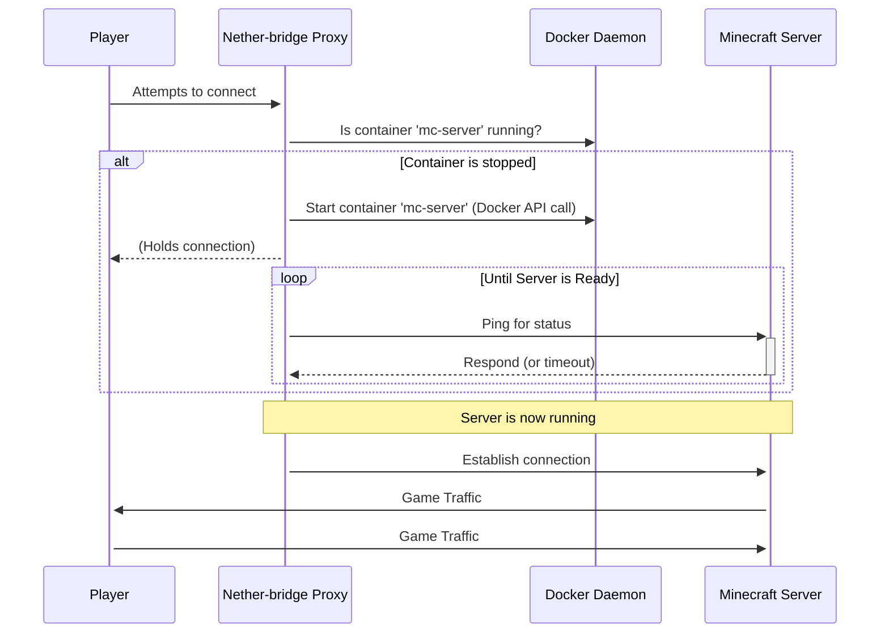

# README.md
# Nether-bridge: On-Demand Minecraft Server Proxy

[](https://github.com/meek2100/nether-bridge/actions/workflows/main-build.yml)
[](https://github.com/meek2100/nether-bridge/releases)

Nether-bridge is an intelligent proxy for Minecraft servers running in Docker. It automatically starts server containers when a player tries to connect and stops them after a period of inactivity, helping to save system resources.

This is ideal for home server environments where multiple Minecraft servers (Java or Bedrock) are available but not always in use.

## Features

- **On-Demand Server Startup**: Automatically starts Minecraft server containers when a player connection is detected.
- **Multi-Platform Support**: Natively supports both **Minecraft: Java Edition** and **Minecraft: Bedrock Edition** servers.
- **Automatic Shutdown**: Monitors server activity and stops containers after a configurable idle period to free up resources.
- **Multi-Server Support**: Manages multiple Minecraft servers simultaneously, each on its own port.
- **Dynamic Readiness Probing**: Uses `mcstatus` to actively query the server status, ensuring it's fully ready before forwarding player traffic.
- **Flexible Configuration**: Configure with environment variables, `settings.json`, or `servers.json`.
- **Robust Health Checks**: A two-stage health check correctly reports the container's status for Docker and orchestrators.
- **Docker-Native**: Designed to integrate seamlessly with a Docker-based server setup using the host's Docker socket.

## How It Works

The proxy listens for initial player connection packets on the ports you define. Its orchestration logic is simple and resource-efficient.

1.  A player attempts to connect to a server address that points to the Nether-bridge proxy.
2.  The proxy receives the first packet and checks if the corresponding Minecraft server container is running.
3.  **If the server is stopped**, the proxy issues a `docker start` command (via the Docker API) and temporarily holds the player's connection.
4.  The proxy then begins probing the server until it responds to a status query, indicating it's fully loaded.
5.  Once the server is ready, the proxy establishes a direct, two-way connection between the player and the server.
6.  A background task continuously monitors the player count on all active servers. If a server has zero players for a configurable amount of time, the proxy issues a `docker stop` command to shut it down safely.



## Installation

### Prerequisites

- Docker and Docker Compose installed on your server.
- The necessary ports (e.g., `19132/udp`, `25565/tcp`) open on your firewall if players connect from outside your local network.

### Setup Steps

1.  **Clone the repository:**

    ```bash
    git clone [https://github.com/meek2100/nether-bridge.git](https://github.com/meek2100/nether-bridge.git)
    cd nether-bridge
    ```

2.  **Configure your servers:**
    - **Recommended (Environment Variables):** Edit the `docker-compose.yml` file and set the `NB_X_...` environment variables for each Minecraft server you want to manage.
    - **Alternative (JSON Files):** Create `settings.json` and `servers.json` in your configuration directory and mount them into the container.

3.  **Start the proxy:**

    ```bash
    docker compose up -d
    ```

    > **Important Security Note**
    >
    > The `nether-bridge` container requires access to `/var/run/docker.sock` to manage other Docker containers. This grants privileges equivalent to **root-level access** on the host system. Ensure your Docker host is properly secured.

## Configuration

Nether-bridge is configured using a hierarchy:
**Environment Variables > Mounted JSON Files > Default Values**

### Main Proxy Settings

These settings control the proxy's global behavior. They can be set in a
`settings.json` file or overridden with environment variables.

| Environment Variable             | `settings.json` Key              | Default   | Description                                                         |
| :------------------------------- | :------------------------------- | :-------- | :------------------------------------------------------------------ |
| `LOG_LEVEL`                      | `log_level`                      | `INFO`    | Logging verbosity: `DEBUG`, `INFO`, `WARNING`, `ERROR`.             |
| `NB_LOG_FORMATTER`               | `log_format`                     | `console` | Log format: `console` or `json`.                                    |
| `NB_IDLE_TIMEOUT`                | `idle_timeout`                   | `600`     | Seconds a server must be idle (0 players) to be stopped.            |
| `NB_PLAYER_CHECK_INTERVAL`       | `player_check_interval`          | `60`      | How often (seconds) to check for idle servers.                      |
| `NB_SERVER_READY_MAX_WAIT`       | `server_startup_timeout`         | `120`     | Max time (seconds) to wait for a newly started server to respond.   |
| `NB_SERVER_STOP_TIMEOUT`         | `server_stop_timeout`            | `60`      | Time (seconds) Docker will wait for a server to stop gracefully.    |
| `NB_QUERY_TIMEOUT`               | `query_timeout`                  | `5`       | Timeout (seconds) for a single `mcstatus` query.                    |
| `NB_PROMETHEUS_ENABLED`          | `is_prometheus_enabled`          | `true`    | Set to `false` to disable the Prometheus metrics endpoint.          |
| `NB_PROMETHEUS_PORT`             | `prometheus_port`                | `8000`    | Port for the Prometheus metrics server.                             |
| `NB_HEALTHCHECK_STALE_THRESHOLD` | `healthcheck_stale_threshold`    | `60`      | Seconds before the heartbeat is considered stale.                   |
| `NB_HEARTBEAT_INTERVAL`          | `healthcheck_heartbeat_interval` | `15`      | How often (seconds) the main proxy loop updates its heartbeat file. |
| `NB_INITIAL_BOOT_READY_MAX_WAIT` | `initial_boot_ready_max_wait`    | `180`     | Max wait time for a server found running on initial proxy boot.     |
| `NB_SERVER_STARTUP_DELAY`        | `server_startup_delay`           | `5`       | Delay (seconds) after starting a server before the first query.     |
| `NB_INITIAL_SERVER_QUERY_DELAY`  | `initial_server_query_delay`     | `10`      | Delay (seconds) before querying a server found running at startup.  |
| `NB_TCP_LISTEN_BACKLOG`          | `tcp_listen_backlog`             | `128`     | Max number of queued TCP connections for Java servers.              |
| `NB_MAX_SESSIONS`                | `max_concurrent_sessions`        | `-1`      | Max concurrent sessions. `-1` means unlimited.                      |

**Example `settings.json`:**
```json
{
  "log_level": "DEBUG",
  "idle_timeout": 900,
  "max_concurrent_sessions": 50
}
```

### Server Definitions

Servers can be defined via environment variables (which take priority) or in a `servers.json` file.

| Env Var Prefix (`NB_X_...`) | `servers.json` Key | Required | Description                                                  |
| :-------------------------- | :----------------- | :------- | :----------------------------------------------------------- |
| `_NAME`                     | `name`             | Yes      | A friendly name for the server.                              |
| `_GAME_TYPE`                | `game_type`        | Yes      | Server type: `bedrock` or `java`.                            |
| `_PROXY_PORT`               | `proxy_port`       | Yes      | The public port Nether-bridge listens on.                    |
| `_CONTAINER_NAME`           | `container_name`   | Yes      | The Docker container name of the game server.                |
| `_PORT`                     | `port`             | Yes      | The internal port the game server uses inside its container. |
| `_HOST`                     | `host`             | No       | Internal IP of the server. Defaults to `127.0.0.1`.          |
| `_QUERY_PORT`               | `query_port`       | No       | Query port if different from game port.                      |
| `_PRE_WARM`                 | `pre_warm`         | No       | `true` to start this server with the proxy.                  |

*Replace `X` with a unique number (e.g., `1`, `2`) for each server when using environment variables.*

**Example `servers.json`:**
```json
{
  "servers": [
    {
      "name": "Bedrock Survival",
      "game_type": "bedrock",
      "proxy_port": 19132,
      "container_name": "mc-bedrock",
      "port": 19132
    }
  ]
}
```

## Health Checks

The application includes a robust health check used by Docker to monitor its status, verifying that the configuration is valid and the main process is alive.

## Console (Switch, Xbox, PlayStation) Support

To allow Minecraft Bedrock Edition on consoles to connect, you need to use a DNS redirector service like `Pugmatt/BedrockConnect`. The main `docker-compose.yml` file contains a commented-out, optional service for this purpose.

The connection flow for consoles is:
**Console** → **BedrockConnect** (Port 19132) → **Nether-bridge** (Port 19133) → **Minecraft Server**

### Setup for Console Support

1.  **Enable the Service**: In your `docker-compose.yml` file, uncomment the entire `bedrock-connect` service.

2.  **Update Nether-bridge Config**: Reconfigure the `nether-bridge` service to listen for Bedrock traffic on a new port (e.g., `19133`) since `bedrock-connect` will now be using the default port `19132`. You must update both the `ports` mapping and the `NB_1_PROXY_PORT` environment variable.

3.  **Configure `BedrockConnect`**: Create a file at `data/bedrock-connect/servers.json` with the following content. This tells `BedrockConnect` to show a server list that points to your Nether-bridge proxy's new port.

    ```json
    [
      {
        "serverName": "My On-Demand Survival",
        "serverAddress": "nether-bridge",
        "serverPort": 19133
      }
    ]
    ```

4.  **Configure Console DNS**: On your gaming console, change your network's primary DNS server to the IP address of the machine running Docker.

5.  **Connect**: Launch Minecraft on your console, navigate to the "Servers" tab, and any of the featured servers should now show your custom server list.

## License

[MIT License](LICENSE)

## Contributing

Contributions are welcome! Please feel free to open issues or pull requests on the GitHub repository.

## Developer Guide

This section contains information for developers working on the
Nether-bridge project, specifically regarding advanced testing environments.

### Testing with a Remote Docker Host

The test suite can be configured to run on a local machine (e.g., Windows
with VS Code) while targeting a Docker daemon running on a remote machine
(e.g., a Debian VM). This is controlled by the `tests/.env` file.

#### Remote Host (Debian VM) Setup

1.  **Expose Docker Daemon**: Configure the Docker daemon to listen for
    remote connections by editing or creating `/etc/docker/daemon.json`:

    ```json
    {
      "hosts": ["unix:///var/run/docker.sock", "tcp://0.0.0.0:2375"]
    }
    ```

    Then, restart Docker: `sudo systemctl restart docker`.

2.  **Configure Firewall**: Allow connections to the Docker port (e.g.,
    using `ufw`):

    ```bash
    sudo ufw allow 2375/tcp
    sudo ufw reload
    ```

> **Note:** This setup assumes that your remote Docker host is located
> within a private network. For security best practices, refer to the
> official guide on [protecting access to the Docker daemon
> socket](https://docs.docker.com/engine/security/protect-access/).

#### Client Host (Windows/Linux) Setup

1.  **Create `.env` file**: In the `tests/` directory, create a file named
    `.env` (if it doesn't exist already) based on `tests/.env.example`.

2.  **Configure `.env`**: In `tests/.env`, set the `DOCKER_HOST_IP`,
    `DOCKER_CONNECTION_TYPE`, `DOCKER_CONNECTION_PORT`, and optionally
    `DOCKER_SSH_USER` variables to match your remote Docker host setup.

    Example for TCP connection:
    ```
    DOCKER_HOST_IP="192.168.1.100"
    DOCKER_CONNECTION_TYPE="tcp"
    DOCKER_CONNECTION_PORT="2375"
    ```

3.  **Run Tests**: With this `.env` file in place, running `pytest` from
    your local machine will automatically target the remote Docker daemon.
    To switch back to using a local Docker installation, simply remove or
    comment out these variables in `tests/.env`.